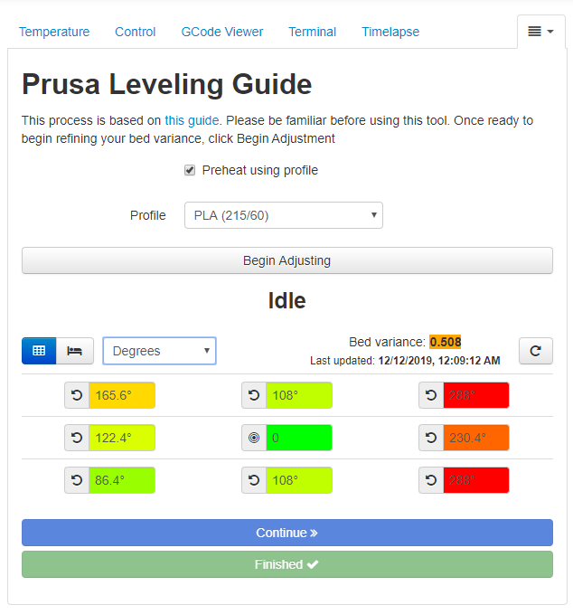
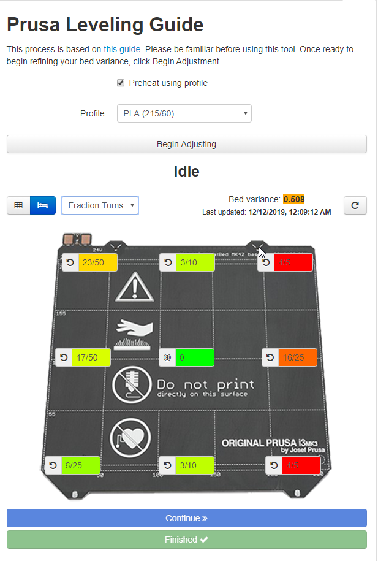

# OctoPrint-PrusaLevelingGuide

**Start here**
[Bed Leveling without Wave Springs](https://github.com/PrusaOwners/prusaowners/wiki/Bed_Leveling_without_Wave_Springs)

This plugin is to help guide you through the fine adjustments of the nylock bed leveling method for Prusa MK3 printers, which is described in the above guide.  Make sure you start there and already have the nylocks applied to your bed before beginning.  This plugin allows you to select a profile for preheating, then begin adjustment.  For each round of adjustment, the plugin will send the configured mesh level code and gcode for retrieving values (generally G80; G81).  Once values are received, you can view how to adjust your bed in a number of ways.  You click continue to proceed with another round of leveling or click finish to finish up.

*TODO: Allow configuration of a 'target bed variance' and alert whenever the bed is higher than the target variance - will only work if you configure your print start/print finish gcode to include G81*

You have the option of viewing the values in a table view or overlayed on a photo of the heatbed.  You can also customize whether you view raw values, degrees, decimal turns, or factional turns.

**Table View**

**Bed View**

## Inspirations

- [Bed Leveling without Wave Springs](https://github.com/PrusaOwners/prusaowners/wiki/Bed_Leveling_without_Wave_Springs) obviously I would not have written this plugin without this awesome mod/guide
- [OctoPrint-PrusaMeshMap](https://github.com/PrusaOwners/OctoPrint-PrusaMeshMap) This is the plugin I used previously to adjust my bed.  It works, but I wanted something a little more automated.  Some of the code for detecting g81 response was used from this plugin.
- [g81_level_guide](https://gitlab.com/gnat.org/g81_level_guide) I like the idea of this script because it automates the process, but I didn't like that it clears my preheat when connecting and that it was a pain to get running on a pi.  The idea inspired me to write this plugin.
- [g81_relative](https://github.com/pcboy/g81_relative) This is the site I originally used for converting my g81 values to relative numbers.  This is what inspired me to add all the different calculation types.

## Setup

Install via the bundled [Plugin Manager](https://github.com/foosel/OctoPrint/wiki/Plugin:-Plugin-Manager)
or manually using this URL:

    https://github.com/scottrini/OctoPrint-PrusaLevelingGuide/archive/master.zip

## Configuration

The configuration tab allows you to customize the gcode for mesh leveling similar to the PrusaMeshMap plugin.

## G81 Output Handler

Just like the PrusaMeshMap plugin, this plugin has a handler that is watching output received from the printer **at all times**. This means you can place a G81 in octoprint's or your slicer's start or stop gcode and the plugin will update its values after every print.